# GD Level Request Bot

This feature-rich bot is designed to simplify and automate the process of requesting and reviewing Geometry Dash levels.

**Features**:

- Simple and intuitive level request creation
- Two-step reviewing system with a friendly UX
- Trainee system
- Effortless management
- Flexible and easy-to-setup permissions
- Adjustable cooldowns and bans both for users AND levels
- Automatic and manual request queue opening and closing
- Detailed logs and a built-in log browser with rich filtering
- Thorough integration with the [Request Bot Control Panel](https://github.com/Gulvan0/RequestBotControlPanel)
- BI analytical report system providing insights about reviewer and regular member involvement
- 100% localized, supporting both English and Russian and automatically adapting to the interacting user
- Fully customizable: everything from texts and channels to behaviour parameters can be changed just by typing a command
- Regular database backups and a command for rolling back to the saved snapshot
- Instant and descriptive PM error notification
- Staging system allowing testing of new features and fixes without interrupting the production bot
- Lots of QoL commands and stuff

## User Guide

### Requests

#### Standard Request Flow

To request a level, a server member must use the `/request create <level_id>` command and then fill and submit the pop-up modal.

The modal asks for the showcase link and an additional comment, if any. By default, showcase is only required for platformer and classic demon levels, however, this can be customized with parameters `request.min_stars_to_require_showcase` and `request.always_require_showcase` (see **Parameters** section for more details).

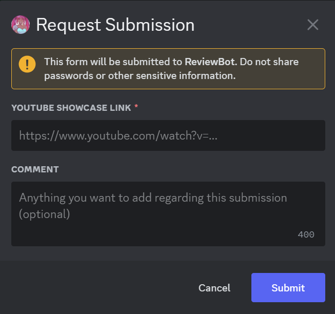

This will trigger a sequence of checks:

1. Is the request queue open? 
    
    _Users with the `request_while_queue_closed` permission bypass this check._

2. Is the user currently on cooldown?

    _Users with the `no_request_cooldown` permission bypass this check._

    _Staff members with the `ban_users` permission can lift the cooldown (see the **Cooldowns and Bans** section)._

3. Has the requested level already been approved by one of the mods?

4. Is this level currently being reviewed?

5. Does a level with the provided ID exist?

6. Is the requested level currently on cooldown?

    _Staff members with the `ban_levels` permission can lift the cooldown (see the **Cooldowns and Bans** section)._

7. Is the requested level already rated?

8. Is the provided showcase link a valid YouTube video link?

All enlisted checks except the last one are evaluated **before** a modal appears, saving time and effort in case of an occasional mistake.

If any of the checks is failed, a bot will respond with a clear explanation of what went wrong.

The language of the request is detected automatically. For more details, refer to the **Language** section.

If the checks mentioned above are passed, a bot stores a level request to a database and sends the _Reviewer's Widget_ to a specific channel.

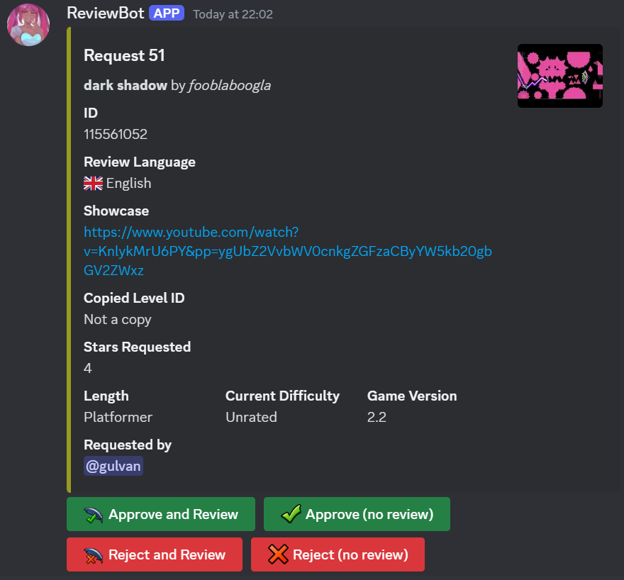

Here, any reviewer (i.e. a user with the `reviewer` permission) can leave the opinion regarding the level and, optionally, a review. 

If additional details can or should be provided (a review if a reviewer chose to leave one and/or a rejection reason if a reviewer rejected the level), pressing the respective button will cause a modal to appear. It is mandatory to specify the reason for rejecting the level if a review is not provided, but otherwise it's not required.

If a reviewer chooses to leave a level review, the request author gets immediately notified. This, however, does not apply to the opinions left without a review. The notification includes the text of the review, splitting it into multiple messages in case it's too long. The splitter tries not to split messages in the middle of the word. However, although rarely, it still can happen when there is a too long word (over 20 characters) right at the splitting point.

If a `request.append_conclusion_to_review` parameter is set to `true`, a conclusion exposing the reviewer's opinion is appended to the review text. By default, this feature is not enabled so as not to provoke questions in case of a discrepancy between regular reviewers' opinions and the final decision made by a GD moderator.

Reviewers can only leave their opinion (and, possibly, a review) once per each request. It's not possible to change the opinion or change the review's text after they were submitted.

Once the first opinion is received, a _Resolution Widget_ gets posted in the channel for GD moderators.

It has all the info from the Reviewer's Widget and also a _Consensus_ section outlining the opinions left by reviewers. Once a new opinion is received, this section gets updated accordingly.

If a reviewer left an opinion with a level review, a link leading to the message with the review text will be provided. Otherwise, if a rejection reason is specified, it's text will be provided instead.

Only GD moderators (users with a `gd_mod` permission) are allowed to interact with the Resolution Widget.

Like with Reviewer's Widget, one GD moderator can resolve each request only once. And, likewise, it's neither possible to change the resolution, nor update the text of the review that came with it.

Pressing any button will cause the modal to appear. In this modal, a review text and an additional comment (replaced by a rejection reason when rejecting a level) may be provided. Both those fields are, however, optional.

After the modal is submitted, the request will get resolved, which implies the following sequence of events:

1. If a review is provided, its text will be sent to the reviews channel and the request author will get pinged. This is completely identical to how it happens after a regular reviewer leaves a review. The presence of the conclusion outlining the final decision is controlled by the `request.append_conclusion_to_final_review` parameter.

2. In the same manner as with regular reviewers' opinions, the resolution gets appended to the Resolution Widget. While reviewers' opinions are listed in the _Consensus_ section of the embed, the resolutions fall into the separate _Resolutions_ section.

3. The Reviewer's Widget gets moved from the channel for reviewers to the archive channel. The embed changes the color from yellow to gray and the interaction buttons get removed. Moreover, a link leading to the Resolution Widget is appended to the embed, making it easy to check the resolutions for an archived level, if an interested user has access to the GD moderator channel.

    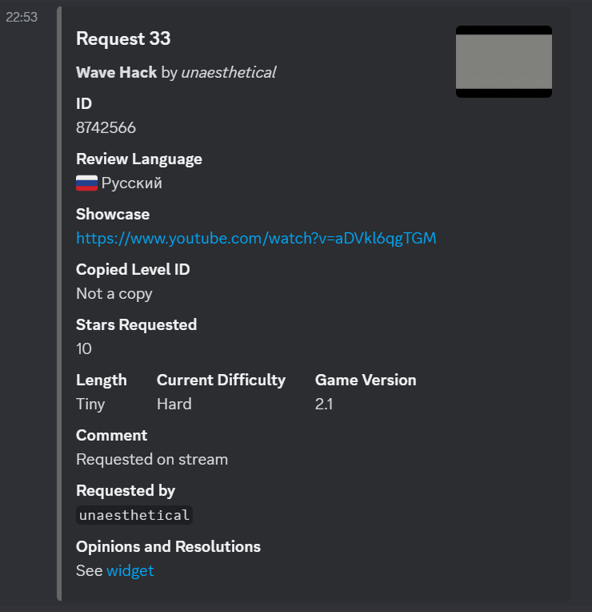

4. The Resolution Widget does **not** get removed and its buttons stay intact so that other GD moderators are able to leave their own independent decisions regarding the level. The color of the embed, however, changes from red to green to indicate that the corresponding request has already been resolved.

5. The request author gets notified about the final decision. The approval and rejection notifications go to the two different channels, but they can be configured to point to the same one (see the **Updating the message's destination channel** section).

    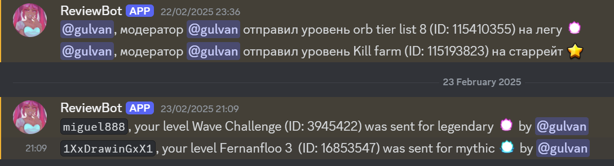

It is important to point out that GD moderators with the `reviewer` permission can leave opinions via the Reviewer's Widget like regular reviewers. It may be useful when all the requests awaiting final resolution were resolved, but the regular reviewers still haven't left their opinions on all the requested levels.

In this situation, a GD moderator should leave the review **only once** (either via the Reviewer's Widget or via the Resolution Widget, but not both!). Otherwise, the ping in the reviews channel will get duplicated.

#### Picking the right request

It is advised that the moderators looking for the requests to review prioritize ones with the red Resolution Widgets. This way, more level requests get resolved.

To pick an unresolved request without having scroll through the Resolution Widgets, a GD moderator may use the command `/request unresolved`.

Similarly, a regular reviewer may use the command `/request ignored` to pick a request without opinions. It is better to leave an opinion on such requests first.

#### Finding a request for a certain level

To find the latest request by a requested level's ID, use command `/request widgets <level_id>`. It will print the links leading to all the available widgets corresponding to the most recent request of the given level.

The link to Resolution Widget is only provided if a level has more than one opinion.

If the request is resolved, the first link will lead to the archive entry rather than to the Reviewer's Widget (which has already been deleted in that case).

#### Inserting a request on behalf of another person

To swiftly request a level bypassing all the checks (where possible), any user with the `insert_requests` permission can use the command `/request insert`. This also allows to create requests on behalf of another creator.

The `/request insert` command takes the following parameters:

1. `level_id`

    ID of a requested level, just like with the normal `/request create` command.

2. `language`

    Language of the request. The reviews will be asked to be written in this language. Moreover, this language will be used for communication with the request author in all of the notifications.

    Set this to the language spoken by the creator on behalf of whom you're requesting a level. If not sure, pick English.

3. `yt_link`

    A link to the YouTube video showcasing the level (optional). Just like in the request creation modal.

4. `creator_mention`

    A tag of the creator of the level. This member will be pinged in every notification.

    If it's impossible to find a level creator on a current Discord server, omit this option and pass `creator_name` instead.

5. `creator_name`

    A name of the creator of the level. The notifications will address the author by this name, however, they won't ping anyone.

    If you're able to find a level creator on the server, it's better to pass their tag to the `creator_mention` argument instead.

    At least one of the options `creator_mention` and `creator_name` must be provided. It is assumed only one of them is actually passed. Conversely, if both are provided, `creator_mention` takes precedence and `creator_name` gets ignored completely.

6. `additional_comment`

    Any additional info that will appear in the request's widgets. Just like in the request creation modal.

    This argument may be omitted if there's nothing special to say about this request.

#### Deleting a request

In case a request was mistakenly created, one can use `/request delete` to silently remove both database entries corresponding to this request and messages containing this request's widgets.

Please only use this in extreme cases as it may erase the important data.

### Queue

#### Automatic queue control

Request queue may be configured to be closed automatically when a number of pending level requests reaches a certain amount. This is done by setting parameter `queue.block_enabled` to `true`. The maximum number of requests is specified via the `queue.block_at` parameter.

Analogically, `queue.unblock_enabled` and `queue.unblock_at` parameters control the automatic reopening of the request queue.

If both auto-block and auto-unblock are enabled, it is recommended to set the threshold values in such a way that their difference will be big enough (at least 10 requests). This way, the queue won't toggle between open and closed states too frequently.

#### Manual queue control

It is also possible to close and re-open the queue manually. To achieve this, use the `/queue close` and `/queue open` commands respectively.

One thing to pay attention to when closing or opening queue manually is the automatic queue control settings described in the previous section. If the queue is re-opened, but the `queue.block_enabled` parameter is set to `true`, the first request to be submitted after the re-opening will close the queue again (as long as the number of pending requests remains above the threshold specified by the `queue.block_at` parameter). Likewise, the queue may re-open after being manually closed once the first request resolution is made if the automatic re-opening is still intact. Because of these nuances, an admin might want to disable automatic queue control before or right after manually changing the queue's state.

The state of the queue is controlled by the `queue.blocked` parameter, but users are **highly discouraged** to assign values to it directly, as it circumvents the usual queue closing/re-opening algorithms (for example, users don't get notified about those events). Instead, use the commands listed above.

At any point in time you may view the current queue's state and settings by using the `/queue info` command.

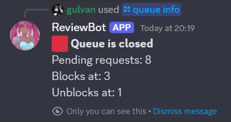

#### Notifications

By default, users are notified (and pinged) whenever a queue closes or re-opens. It happens regardless of whether the state was changed automatically or manually.

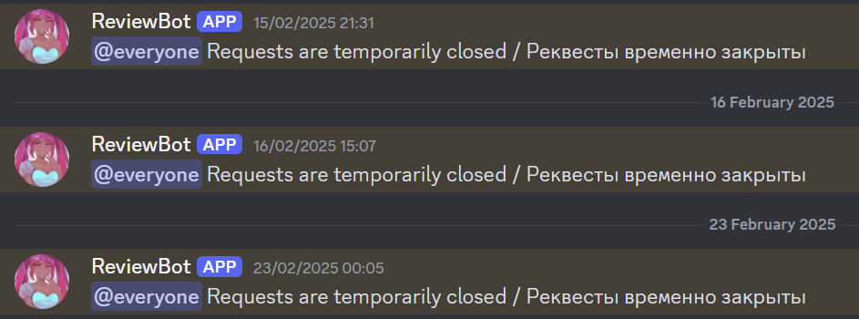

To disable those notifications, turn off the respective routes: `requests_closed` for closing events and `requests_reopened` for re-opening events. Refer to the **Message Routes** section of this guide to learn about route management.

#### Queue History

Use the `/queue history` command to see the history of queue closings and re-openings. It will be displayed as a sequence of log events. Logging is described in the **Logs** section.

### Cooldowns and Bans

#### Overview

After a successful submission of the level request, a user is put on cooldown. Its duration is declared by the `cooldown.post_request_user_cd` parameter.

After a level gets rejected by a GD moderator, it also gets put on cooldown, the duration of which is defined by the `cooldown.post_reject_level_cd` parameter.

To remove a cooldown for a user, use the `/usercd amend` command. To put a user on cooldown or extend/shorten the existing cooldown of a user, use `/usercd update`. Both those commands have an optional `reason` argument allowing the staff member to explain this action for future reference.

#### Cooldown duration

`/usercd update` accepts duration in the specific format. It is outlined in the help section, which you can view by using the `/help duration` command.

Cooldowns can be infinite and are referred to as bans in this case. To ban the user forever, pass `inf` as the value of the `/usercd update` command's `duration` argument.

To extend or shorten an existing user ban, pass relative duration to the `/usercd update` command. Relative durations have exactly the same format as absolute, but are prepended with a plus or a minus sign to denote the extension or contraction respectively.

Naturally, passing an absolute duration results in setting the user's cooldown to a provided value, ignoring an existing cooldown, if any.

#### Getting cooldown info

The `/usercd describe` command can be used to view info about the user's cooldown, such as its expiration date and time, who cast this cooldown and why. If a cooldown is a result of the level request submission, the corresponding level request will be linked as well.

The `/usercd list` command enlists all users currently on cooldown (or banned). It has two different modes, namely "List temporary cooldowns" and "List lifetime bans".

Finally, the `/usercd history` command yields an entire history of specific user's cooldowns.

#### Level cooldowns

Everything said about the user cooldowns in the previous sections also applies to level cooldowns.

Each `/usercd` subcommand has its direct counterpart in the `/levelcd` command group. Those commands are perfectly equivalent to one another.

#### Permissions

Commands in the `/usercd` group can only be executed by members with the `ban_users` permission. Likewise, commands in the `/levelcd` group can only be executed by members with the `ban_levels` permission.

By default, you can only amend a cooldown/ban if it was cast by you. Permissions `remove_other_level_bans` (for level cooldowns and bans) and `remove_other_user_bans` (for user cooldowns and bans) give you an ability to remove a cooldown even if it was cast by another member.

### Trainees

#### Overview

The request bot has a trainee system allowing the admins to recruit certain users for a probation period. This is done by providing a certain user with a `trainee` permission.

Trainees are allowed to interact with a Reviewer's Widget. Their options, however, are limited to ones implying leaving a review. Trainees cannot accept or reject a level without a review.

Alternatively, a trainee may use the `/trainee pick` command to pick a random level to review. Those levels get selected not only from the requests that are currently pending, but also from the archive.

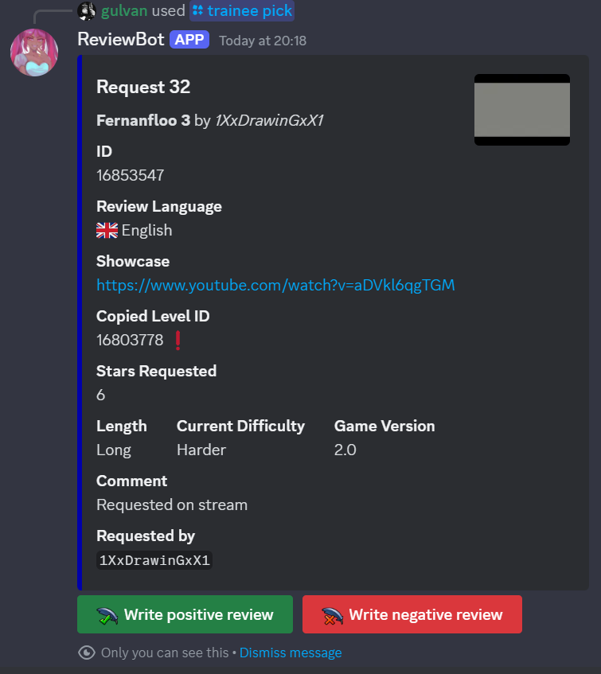

Reviews submitted by trainees don't get published in the normal review channel and the request authors don't get notified about them. Additionally, trainee opinions do not make their way into the Consensus section of the Resolution Widget. In other words, trainees don't take part in the normal request reviewing pipeline whatsoever.

#### Assessing the trainee reviews

The reviews written by trainees, however, get posted in the special trainee channel defined in the `trainee_review_text` route. The message containing their review will be written in the language of the request (which is usually the language the user that has requested the level speaks). If there is a discrepancy between the languages of the review and the surrounding text, it means that a trainee mistakenly wrote a review in a different language than the one it was requested in.

Those reviews get complemented with the "Approve" and "Reject" buttons allowing trainee curators (that is, anyone with the `trainee_supervisor` permission) to leave their opinion about these reviews and (optionally) give useful feedback.

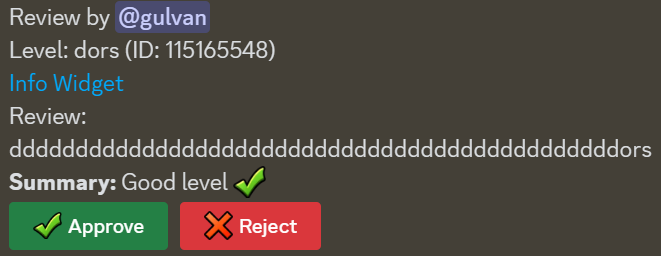

If the feedback is provided, it gets posted in a newly created thread under the original trainee review text message. The trainee also gets pinged in this thread. Due to this, it is important to give any trainee the access to the trainee review channel, or else the trainee curators will have to resend their feedback to their mentees manually.

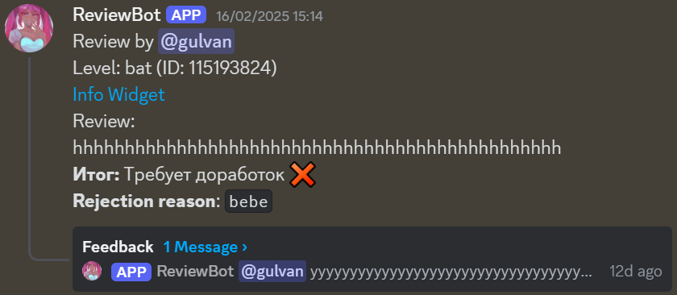

Each trainee review can be assessed only once. This also means that two curators cannot both leave feedback about the same review (or, to be precise, they actually can, but one of them will have to communicate with the trainee manually).

#### Resolution

The grades trainees receive for each of their reviews get counted. Once a certain amount of the graded reviews is reached, curators are offered to promote or expel the trainee. This amount is specified via the `trainee.resolved_reviews_for_promotion_decision` parameter.

The promotion and expulsion are done using the buttons in the response following accepting or rejecting of trainee review. The text of the response also contains useful information about the trainee probation, for example, the approval percentage of his/her reviews. The response can be simply dismissed if a curator is not yet ready to make final decisions regarding the assessed trainee.

At any point, even before the required number of graded reviews is reached, the trainee can be promoted or expelled by a curator or an admin using the `/trainee promote` and `/trainee expel` commands respectively.

In essence, trainee promotion is taking `trainee` permission from the user and replacing it with the `reviewer` permission. At the same time, expulsion is just removing the `trainee` permission granting nothing in return. As permissions can be only granted to roles, those removals are done by revoking the corresponding roles.

Command `/reviews user` proves very useful for trainee assessment as it returns all reviews written by a certain user. It should be noted, though, that this command is usable on any server member, not only on trainees. Therefore, regular reviewer's reviews can also be listed using the same command.

### Reports

#### Overview

The bot also includes the diverse reporting system allowing admins to browse all the essential data to make informed decisions. The reports are presented as plots. All reports are requested by using the command in the `/report` group.

Every report command provides a way to specify the date period over which the data is collected. This is done using the `date_from` and `date_to` arguments. Both should follow the `YYYY-MM-DD` format (for example, `2024-06-13` is an admissible value).

Most of the reports also have a `granularity` argument allowing users to choose between displaying the daily and weekly data.

#### New Requests

The dynamics of the number of level requests created by the server members can be seen by calling the `/report new_requests` command.

The daily version of the report also includes an additional feature. Any day during which the queue was completely closed is highlighted in red. Note that this does not apply to the days when the queue was closed for some period, but not for the entire 24 hours.

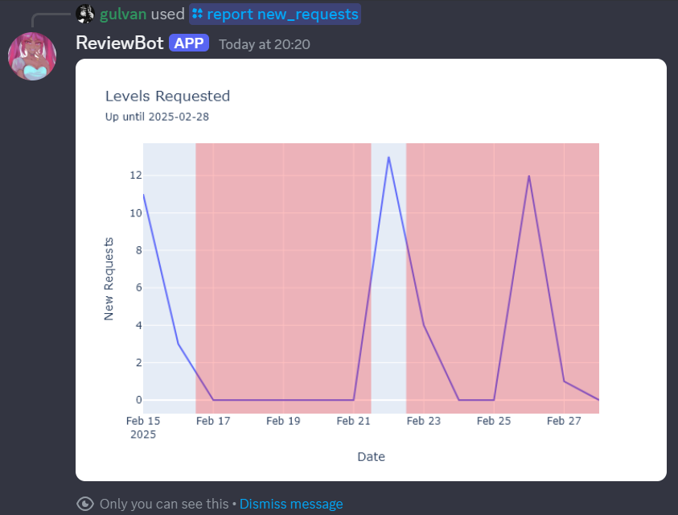

This report is useful to estimate the member engagement and the overall changes in the popularity of the level request system. The effect of the certain promotion campaigns can be also estimated using this plot. Additionally, the plot can be used to see the impact of the queue closing, which in turn can lead to the reconsideration of the auto-blocking and auto-unblocking policies (see **Queue** section for more details).

#### Pending Requests

The dynamics of the number of _pending_ level requests is displayed using the `/report pending_requests` command.

The plot also has lines denoting the queue auto-block and auto-unblock threshold values. However, those lines do not account for possible changes of those thresholds and instead just display the constant, current values at the time of calling the `/report pending_requests` command.

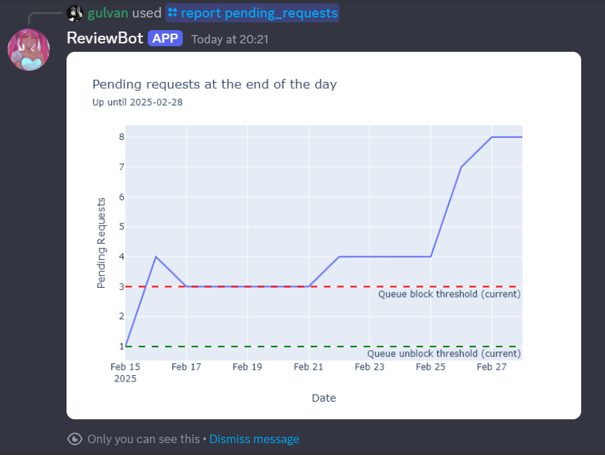

This report is useful for assessing the reviewer team efficiency and can be an important signal for hiring more reviewers. Moreover, it allows to check the restrictiveness of the auto-block and auto-unblock thresholds.

#### Reviewer's Opinions

The donut chart depicting the proportion of level approvals and rejections by a certain reviewer can be viewed by the `/report reviewer_opinions` command.

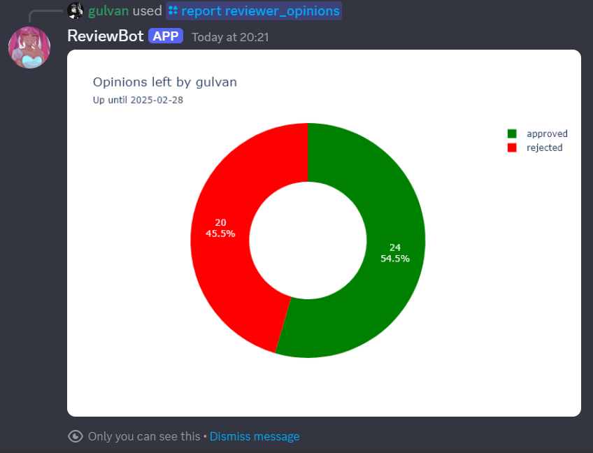

It can be used to compare reviewers in terms of their strictness.

#### Reviewer Activity

This aggregate chart, requested by `/report review_activity` command, shows the dynamics of the number of reviews posted by every reviewer separately.

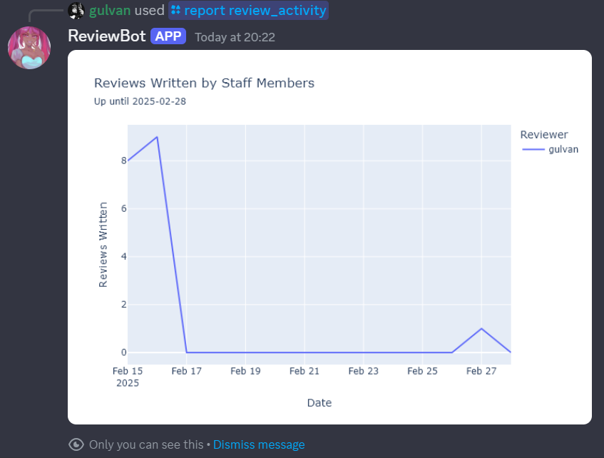

Detecting the slacking reviewers is an obvious, but not only purpose of this graph. Another useful application is learning about the reviewer's weekly/seasonal habits allowing the admin to predict when a certain reviewer will have more free time and when his/her inactivity is not a reason for concern.

### Language

The bot tries to interact with each user in the language they speak. The language is detected using the following algorithm:

1. If a user has explicitly set their language using the `/language` command previously, then this language is used.

2. Otherwise, the language corresponds to the user's Discord locale settings chosen in the user preferences.

3. If the information about the user's locale is unavailable (an extremely rare sight!), but the user has the Russian speaker role, the bot will communicate in Russian. This role's ID is hardcoded in the bot's configs. It's better to use the role granted by the bots such as ReactionRoles for that purpose.

4. In all other cases (when a user hasn't set their language, the info about their locale settings is unavailable, and he/she doesn't have a Russian speaker role), the bot will speak English.

Falling to the steps 3-4 is very unlikely, but if that happens, the bot will treat the language choice as unreliable and will propose the interacting user to set their language directly.

### Permissions

The bot has a simple permission system allowing restricting access to certain commands as well as adjusting the behaviour logic in some cases (for instance, forbidding the trainees to leave the opinion without the review).

Permissions can be granted simply by adding a role associated with a certain permission to a chosen user via the Discord's UI. To associate a role with the permission, use the `/permission bind` command, and to break this link, call the `/permission unbind` command.

Multiple permissions may be bound to the same role. This is useful to provide certain members access to an entire scope of permissions using a single role. To clear all the permissions associated with a role, use `/permission clear` command.

While it's possible to bind multiple roles to the same permission, it's undesirable to do so. In some corner cases the logic may become fuzzy. For example, promoting a trainee to the reviewer position will only grant him/her one random role out of those bound to the `reviewer` permission.

To list all the permissions a certain member has, use the `/permission describe_member` command. As a bonus, it will also provide insight on which roles provide this member with each of his/her permissions.

To see which roles are associated with which permissions, simply call the `/permission list_roles` command.

The following permissions exist in this bot (can also be retrieved by calling the `/permission list_flags` command):

- `admin` - Grants every existing permission and also provides exclusive access to the queue control and bot's settings (templates, routes, parameters, permissions etc.).
- `log_viewer` - Allows browsing logs (See **Logs** section).
- `report_viewer` - Allows generating reports (See **Reports** section).
- `reviewer` - Allows interaction with the Reviewer's Widget (see **Standard Request Flow** section).
- `trainee` - Marks the owner as trainee, handling his/her reviews differently compared to regular reviewers (see **Trainees** section).
- `trainee_supervisor` - Allows promoting/expelling trainees, assessing their reviews and giving feedback (see **Trainees** section).
- `gd_mod` - Allows interaction with the Resolution Widget (see **Standard Request Flow** section).
- `ban_levels` - Allows level cooldown and ban manipulations (see **Cooldowns and Bans** section).
- `ban_users` - Allows user cooldown and ban manipulations (see **Cooldowns and Bans** section).
- `no_request_cooldown` - Members with this permission have request cooldown immunity (see **Standard Request Flow** section).
- `request_while_queue_closed` - Members with this permission can request levels even when the queue is closed (see **Standard Request Flow** section).
- `insert_requests` - Grants access to the `/request insert` command (see **Inserting a request on behalf of another person** section).
- `remove_other_level_bans` - Members with this permission can amend level cooldowns and bans even if they weren't cast by them (see **Cooldowns and Bans** section).
- `remove_other_user_bans` - Members with this permission can amend user cooldowns and bans even if they weren't cast by them (see **Cooldowns and Bans** section).

### Parameters

Parameters allow easy adjustment of the bot's certain aspects.

Each parameter has a type restricting the values it can take. As of now, the bot makes use of only four parameter types:
- `natural` - Natural number.
- `uint` - Natural number or 0.
- `bool` - Logical (boolean) value. Allows only two possible values: `true` (can also be passed as `t`, `yes`, `y` for brevity) и `false` (can also be passed as `f`, `no`, `n`). Works as a toggle switch between the two modes of operation.
- `duration` - Represents duration. Values provided should follow a certain strict format described in `/help duration`.

You can change the parameter's value using the `/parameter set` command or reset it back to default using `/parameter reset`.

To see information about the specific parameter, call `/parameter describe`.

The following parameters are exposed by the bot (they can also be listed using the `/parameter list` command):

- `queue.block_at` (type: `natural`) - The maximum number of pending requests upon achieving which the queue is closed automatically, if the `queue.block_enabled` parameter set to `true` (see **Queue** section).
- `queue.unblock_at` (type: `uint`) - The minimum number of pending requests upon achieving which the queue is re-opened automatically, if the `queue.unblock_enabled` parameter set to `true` (see **Queue** section).
- `queue.block_enabled` (type: `bool`) - Whether to close the queue automatically based on the current number of pending requests (see **Queue** section).
- `queue.unblock_enabled` (type: `bool`) - Whether to re-open the queue automatically based on the current number of pending requests (see **Queue** section).
- `queue.blocked` (type: `bool`) - Whether the queue is currently closed (see **Queue** section). **Don't set this parameter directly, use `/queue close` and `/queue open` commands!** 
- `cooldown.post_request_user_cd` (type: `duration`) - The duration of the cooldown cast on a user after he/she successfully submits a level request (see **Cooldowns and Bans** section).
- `cooldown.post_reject_level_cd` (type: `duration`) - The duration of the cooldown cast on a level after it gets rejected by a GD moderator (see **Cooldowns and Bans** section).
- `request.append_conclusion_to_review` (type: `bool`) - Whether to append the conclusion explicitly stating the reviewer's opinion to the review text of a regular reviewer (see **Standard Request Flow** section).
- `request.append_conclusion_to_final_review` (type: `bool`) - Whether to append the conclusion explicitly stating the reviewer's opinion to the review text of a GD moderator (see **Standard Request Flow** section).
- `request.min_stars_to_require_showcase` (type: `natural`) - A minimum number of requested stars a classic level should have for the showcase to be required when a request is submitted (see **Standard Request Flow** section).
- `request.always_require_showcase` (type: `bool`) - Whether to require specifying the link to the showcase when submitting the level request _regardless_ of the requested level's difficulty and type (see **Standard Request Flow** section).
- `trainee.resolved_reviews_for_promotion_decision` (type: `natural`) - Upon achieving what number of assessed trainee's reviews the trainee curators are offered to promote or expel the trainee (see **Trainees** section).

### Message Routes

With the exception for the message text, the customization of which is discussed in the next section, the messages that the bot sends are configured using the notion of _routes_. 

Every message gets sent to a specific route, that is associated with a specific target channel where the message is intended to be posted. Such target channels can be changed at ease with the usage of the `/route update_channel` command. If there's a need to revert such changes, `/route reset_channel` can be called to set the route's target channel back to its default value.

A route can be manually disabled. If that's the case, all messages sent to it will not be posted anywhere. Hence, disabling a route is an easy way to mute all messages of a specific kind. This can be done by executing the `/route disable` command. In the same way, disabled routes can be re-enabled by calling the `/route enable` command.

`/route describe` will yield a description of the route's purpose (what kind of messages get sent to it) as well as provide info about what channel is bound to this route and whether this route is disabled.

The following routes are used by the bot (they can also be listed with `/route list`):

- `log` - for logs (see **Logs** section)
- `pending_request` - for Reviewer's Widgets (see **Standard Request Flow** section).
- `resolution` - for Resolution Widgets (see **Standard Request Flow** section).
- `approval_notification` - for notifying the request author that the level requested by him/her was approved (see **Standard Request Flow** section).
- `rejection_notification` - for notifying the request author that the level requested by him/her was rejected (see **Standard Request Flow** section).
- `review_text` - for posting the level review written by one of the regular reviewers (see **Standard Request Flow** section).
- `trainee_review_text` - for posting the Trainee Review Widget containing the review text wirtten by trainee as well as buttons for approving or rejecting this review (see **Trainees** section).
- `requests_closed` - for notifications pinging everyone when the request queue gets closed (see **Queue** section).
- `requests_reopened` - for notifications pinging everyone when the request queue gets re-opened (see **Queue** section).
- `archive` - for details about the resolved requests (see **Standard Request Flow** section).
- `stream_start_announcement` - for stream start announcements received via API from [Request Bot Control Panel](https://github.com/Gulvan0/RequestBotControlPanel).
- `stream_end_goodbye` - for stream conclusions received via API from [Request Bot Control Panel](https://github.com/Gulvan0/RequestBotControlPanel).

### Message Templates

The text of the messages sent by bot (except for those few that aren't directed to a specific person, like widgets and queue closing/re-opening notifications) can be configured with the usage of _templates_. In fact, templates also control almost any text piece that has at least something to do with the bot: button texts, modal titles and content, descriptions of commands, their arguments and even possible argument values!

Each template is presented by two pieces of text, one for each language. To update the specific template in the specific language, use the `/text edit` command. To reset the template text's value back to default, use `/text reset`.

Formatted text (bold, italic etc.) and the specific components of the message, for example, user/role/channel mention or date and time, can be used in the template's text. Format used is described in the Discord documentation: [here](https://discord.com/developers/docs/reference#message-formatting-formats) (for components) and [there](https://support.discord.com/hc/en-us/articles/210298617-Markdown-Text-101-Chat-Formatting-Bold-Italic-Underline) (for text formatting). Additionally, newlines and other special characters may be included by using escape codes (hence, any literal backslash needs to be escaped as well).

Some templates may have parameters. The concrete values for these parameters get passed directly from the bot's code. Each template has a fixed set of parameters passed to it. 

In the template's text, parameter names wrapped in single curly braces get substituted with the corresponding parameter's value. For example, the message using the template with the text `Hello, {name}!` will read `Hello, Billy!` if the code passes `Billy` as the value of the parameter `name`.

You aren't required (but advised nonetheless) to use every parameter of a given template in its text. But you cannot refer to parameters that a given template _doesn't_ have.

The description of the specific template and all of its parameters as well as the current and default values for its text can be viewed via the `/text describe` command.

All the available templates may be listed using the `/text list` command. There's too much (over 200) of them to list them here.

### Logs

Bot records every significant event separately. Those events are distinguished by their type and each of them has its own set of arguments. At the same time, there are three arguments each event has no matter the type: its type (obviously), user who triggered that event (can be bot itself) and the timestamp (date and time) when this event happened.

Every time an event happens the bot forwards its details (essentially, the values of all its arguments) to the `log` route. Scrolling through the corresponding channel and using Discord's search functionality in it is the simplest way of browsing the logs, but not the only one.

When more versatility is needed, `/log view` command should be used. By default, it just displays all logged events in sequence (you can jump to the concrete moment in time by using the optional `timestamp` argument). But if a _filter_ is active, only the logs matching this filter will get displayed, which narrows the output very significantly.

At the start, the active filter is empty. You can add restrictions to it using the following commands:

- `/log restrict_type` for selecting only the events of one specific type
- `/log restrict_user` for selecting only the events triggered by one specific user
- `/log restrict_custom_field` for restricting any of the type-specific fields

Those restrictions can be lifted with the following commands:

- `/log unrestrict_type`
- `/log unrestrict_user`
- `/log unrestrict_custom_field` - removes one type-specific field restriction
- `/log clear_custom_field_restrictions` - removes ALL type-specific field restrictions
- `/log clear_filter` - removes ALL restrictions from the currently active filter

The configured filters can be reused. To save the currently active filter, use `/log save_filter`. To select a saved filter as an active one, use `/log select_filter`. To remove a saved filter, use `/log delete_filter` and if you want to see the list of all the available saved filters, use `/log list_filters`.

Finally, details on any filter can be displayed via the `/log describe_filter` command. You can provide a filter name to describe a specific saved filter or omit it to describe the currently active filter (even if it's not saved).

### Backup

Every day at 1 AM GMT the bot sends the snapshot of the database to the bot's maintainers. This can be done manually at any time using the `/backup save` command.

If something goes wrong, the former state of the database can be restored using the `/backup load` command. Be wary though that it is unstable and cannot always work (due to how the database is treated).

### Error Handling

In case any error happens during the processing of the user's interaction (command execution, modal submission, button press etc.), the bot will respond with a short explanation and a polite request to provide the details of what happened to the server admin.

At the same time, bot's maintainers will also get a DM containing the full error message.

## Command Reference

### General

`/language`

Set the bot's language

Arguments:
    
- `language` - the language the bot will speak with you

### Backup

`/backup load`

Overwrite the database from the file

Arguments:

- `file` - SQLite database file with which the current one will be replaced

`/backup save`

Backup the database immediately

### Help

`/help duration`

Explain how to specify a duration when passing it as a command argument

`/help timestamp`

Explain how to specify a timestamp when passing it as a command argument

### Level Cooldowns and Bans

`/levelcd amend`

Remove current cooldown for level

Arguments:

- `level_id` - ID of a level whose cooldown is to be removed
- `reason` - Why the cooldown is being removed

`/levelcd describe`

Describe the given level's current cooldown

Arguments:

- `level_id` - ID of a level whose cooldown will be described

`/levelcd history`

Show a cooldown history for a certain level

Arguments:

- `level_id` - ID of a level whose cooldown history will be queried

`/levelcd list`

List levels currently on cooldown

Arguments:

- `cooldown_listing_type` - Whether to display temporary or endless cooldowns

`/levelcd update`

Put a level on a cooldown or modify the cooldown this level currently has

Arguments:

- `level_id` - ID of a level whose cooldown is to be set
- `duration` - Cooldown duration (absolute, relative to the current one or infinite). Format: /help duration
- `reason` - Why the cooldown is being cast/updated

### Logs

`/log clear_custom_field_restrictions`

Remove all custom field value restrictions in a current log filter

`/log clear_filter`

Remove all restrictions in a current log filter

`/log delete_filter`

Delete a certain filter

Arguments:

- `name` - Name of a filter to be deleted

`/log describe_filter`

Describe the filter

Arguments:

- `name` - Name of a filter to describe. Omit to describe the current filter

`/log list_filters`

Lists all the available filters

`/log restrict_custom_field`

Only query events with a provided value of a provided custom field

Arguments:

- `key` - A key of a custom field to be restricted to a certain value
- `value` - A value to restrict a certain custom field to. Only the events having this value will be queried

`/log restrict_type`

Only query events of a provided type

Arguments:

- `event_type` - Only the events with this type will be queried. Successive calls change the selected type

`/log restrict_user`

Only query actions performed by a provided user. Successive calls change the selected user

Arguments:

- `user` - Server member. Only his/her actions will be queried

`/log save_filter`

Save a currently selected filter. This allows it to be reused later

Arguments:

- `name` - Name under which the current filter will be saved

`/log select_filter`

Select a saved filter

Arguments:

- `name` - Name of a filter to select

`/log unrestrict_custom_field`

Remove one custom field value restriction in a current log filter

Arguments:

- `key` - A key of a custom field to remove a restriction for

`/log unrestrict_type`

Remove an event type restriction in a current log filter

`/log unrestrict_user`

Remove a user restriction in a current log filter

`/log view`

Display logs matching the currently selected filter

Arguments:

- `timestamp` - An event timestamp to jump to. Omit to start from the beginning. Format: /help timestamp

### Parameters

`/parameter describe`

View details about a certain parameter

Arguments:

- `parameter` - Parameter to describe

`/parameter list`

List all available parameters

`/parameter reset`

Reset a parameter to its default value

Arguments:

- `parameter` - Parameter to reset

`/parameter set`

Update the value of a parameter

Arguments:

- `parameter` - Parameter to update
- `new_value` - New value to assign

### Permissions

`/permission bind`

Bind the permission to the role

Arguments:

- `permission` - Permission to bind to a role
- `role` - Role to which a permission is bound

`/permission clear`

Unbind all the permissions from the role

Arguments:

- `role` - Role to be cleared from permissions

`/permission describe_member`

List all the permissions a member has and the roles that grant him/her those permissions

Arguments:

- `member` - Member whose permissions to list

`/permission list_flags`

List all permission flags present in the bot

`/permission list_roles`

List all the permission-associated roles along with the permissions bound to them

`/permission unbind`

Unbind the permission from the role

Arguments:

- `permission` - Permission to unbind from a role
- `role` - Role from which a permission is unbound

### Queue

`/queue close`

Close a queue manually. Note that you might also want to disable auto-unblock

`/queue history`

Get queue block/unblock history

`/queue info`

Get info regarding the current state of the queue

`/queue open`

Open a queue manually. Note that you might also want to disable auto-block

### Reports

`/report new_requests`

Plot a number of new requests per day (or week)

Arguments:

- `date_from` - Start of the plotted period. Defaults to the first request date if omitted. Format: /help timestamp
- `date_to` - End of the plotted period. Defaults to the current date if omitted. Format: /help timestamp
- `granularity` - Granularity (whether to display data per day or per week)

`/report pending_requests`

Plot a number of remaining pending requests at the end of each day (or week)

Arguments:

- `date_from` - Start of the plotted period. Defaults to the first request date if omitted. Format: /help timestamp
- `date_to` - End of the plotted period. Defaults to the current date if omitted. Format: /help timestamp
- `granularity` - Granularity (whether to display data per day or per week)

`/report review_activity`

Plot a number of reviews posted by each reviewer per day (or week)

Arguments:

- `date_from` - Start of the plotted period. Defaults to the first request date if omitted. Format: /help timestamp
- `date_to` - End of the plotted period. Defaults to the current date if omitted. Format: /help timestamp
- `granularity` - Granularity (whether to display data per day or per week)

`/report reviewer_opinions`

Plot a proportion of approvals versus rejections by a certain reviewer

Arguments:

- `reviewer` - Reviewer whose opinions proportion is to be plotted
- `date_from` - Start of the plotted period. Defaults to the first request date if omitted. Format: /help timestamp
- `date_to` - End of the plotted period. Defaults to the current date if omitted. Format: /help timestamp

### Requests

`/request create`

Request a level

Arguments:

- `level_id` - ID of a level you want to request

`/request delete`

Delete a request (both database entries and widget messages)

Arguments:

- `request_id` - ID of a request you want to delete

`/request ignored`

Get the oldest pending request without opinions

`/request insert`

Request a level on behalf of another creator bypassing all restrictions

Arguments:

- `level_id` - ID of a level you want to request
- `language` - Language of the reviews. Will also be used to notify the author
- `yt_link` - YouTube link for a showcase. Optional
- `creator_mention` - Creator mention for notifications. Specify creator_name instead if you can't tag a creator
- `creator_name` - Creator's name. Provide only if creator_mention cannot be specified
- `additional_comment` - Additional info about the submission. Optional

`/request unresolved`

Get the oldest request waiting for the final decision

`/request widgets`

Get widget links for a requested level

Arguments:

- `level_id` - ID of a level you want to get the widgets of

### Reviews

`/reviews level`

Get all reviews written for a certain level. Won't include reviews written by trainees

Arguments:

- `level_id` - ID of a level you want to retrieve all reviews for

`/reviews user`

Get all reviews written by a certain user, ordered from newest to oldest

Arguments:

- `author` - Author of the reviews to be retrieved

### Routes

`/route describe`

View details about a route

Arguments:

- `route` - Route to describe

`/route disable`

Disable a route, preventing the messages sent through it to be delivered

Arguments:

- `route` - Route to disable

`/route enable`

Enable a route, allowing the messages to be delivered through it

Arguments:

- `route` - Route to enable

`/route list`

List all available routes

`/route reset_channel`

Reset a route's destination channel to its default value

Arguments:

- `route` - Route to reset

`/route update_channel`

Update a route's destination channel

Arguments:

- `route` - Route to update
- `new_value` - New destination channel

### Templates

`/text describe`

View details about a message template

Arguments:

- `template_name` - Template name

`/text edit`

Edit a message template

Arguments:

- `template_name` - Template name
- `language` - Template language
- `new_value` - Updated template text

`/text list`

List all available message templates

`/text reset`

Reset a message template to its default value

Arguments:

- `template_name` - Template name
- `language` - Template language

### Trainees

`/trainee expel`

Expel a member from the trainees

Arguments:

- `trainee` - Trainee to be expelled

`/trainee pick`

Pick a random request to review

`/trainee promote`

Promote a trainee to a regular reviewer

Arguments:

- `trainee` - Trainee to be promoted

### User Cooldowns and Bans

`/usercd amend`

Remove current cooldown for user

Arguments:

- `user` - User whose cooldown is to be removed
- `reason` - Why the cooldown is being removed

`/usercd describe`

Describe the given user's current cooldown

Arguments:

- `user` - User whose cooldown will be described

`/usercd history`

Show a cooldown history for a certain user

Arguments:

- `user` - User whose cooldown history will be queried

`/usercd list`

List users currently on cooldown

Arguments:

- `cooldown_listing_type` - Whether to display temporary or endless cooldowns

`/usercd update`

Put a user on a cooldown or modify the cooldown this user currently has

Arguments:

- `user` - User whose cooldown is to be set
- `duration` - Cooldown duration (absolute, relative to the current one or infinite). Format: /help duration
- `reason` - Why the cooldown is being cast/updated

## Contributing

### Minimal Prerequisites

In order to be able to understand the code and make meaningful changes, you need to have a grasp of the following concepts and libraries:

- Basic Python
    - Primitive types (`int`, `str`, `bool`, `float`, `None`), their methods and operations on them
    - Containers (`list`, `dict`, `set`, `tuple`), their methods and operations on them
    - Functions (`def`, arguments, return value, `*args` and `**kwargs`)
    - Immutability, mutable and immutable types
    - f-strings
    - Conditional operator (`if`-`elif`-`else`)
    - Loops (`for` and `while`, iterating over containers, `range`, `enumerate`)
    - Pattern matching (`match`-`case`, combining cases, structural matching, matching type)
    - `defaultdict`
    - Iterable unpacking
    - Type conversion logic (especially to `bool`)
    - Elements of functional programming (list and dict comprehension, iterators and iterables, `lambda`, `filter`, `map`, `sorted`, `reversed`)
    - Project structure, modules, `import` and how it actually works, `from ... import`, local imports, circular dependencies
    - `with` (only the usage)
    - File I/O, `pathlib` module (`Path` object and all its methods)
    - Serialization (`JSON` and `YAML` file formats, parsing and dumping them in Python)
    - Regular Expressions and `re` module
    - REST and `requests` module
    - Classes (instantiation, fields and methods, constructor method, `@staticmethod`, `@classmethod`, inheritance, overriding, `super` calls, `@property`, underscore semantics, most useful built-in dunder methods)
    - Dataclasses (`@dataclass`, `field`, `asdict`)
    - Enums (`Enum`, `StrEnum`, `auto()`)
    - Abstract classes (`ABC`, `@abstractmethod`)
    - Exceptions (`raise`, `try`-`except`-`else`, exception objects, built-in exception classes, making your own exception)
    - Type hinting (basic + `typing.Any`, `typing.Callable`, `typing.assert_never()`)
    - Coroutines (`async`, `await`, `typing.Coroutine` type hint)
    - Decorators (how they work and how to make your own)
    - `tkinter` module (only for the Request Bot Control Panel; not used in bot itself)
- Basic knowledge of databases and SQL
- Python packages:
    - `discord.py` (everything from [this](https://fallendeity.github.io/discord.py-masterclass) guide except for the last chapters)
    - `sqlmodel` (everything from [this](https://sqlmodel.tiangolo.com/tutorial/) guide)
    - `fastapi` (only for interaction with Request Bot Control Panel; only the basic stuff is needed: creating endpoints, pydantic models, getting the payload, returning the response, `Depends`; a good guide can be found [here](https://fastapi.tiangolo.com/tutorial/))
    - `pandas` (only for `/report` command group; just some basic stuff)
    - `plotly` (only for `/report` command group; just some basic stuff)
    - `PyYAML` (used in few places)
    - `click` (just to understand the entrance point)
    - `jsonschema` (used to validate the configs)

To deploy the bot, the basics of Docker should also be known.

### Code structure

The source code is composed of the following nodes:

- `main.py` contains the `Bot` class and all the startup instructions. It also contains every FastAPI endpoint. They could have been moved to their own modules, but since the API is so minimalistic at the time, it doesn't seem to be much of a problem.
- `cogs` contains Discord.py cogs and is the entry point of any interaction invoked by a slash command. Cog methods usually don't do actual job and instead relegate it to the facades. The purpose of a cog is just to provide all the necessary decorators to commands and respond to the user interaction with the results retrieved from the facade functions.
- `cog_presets` contain presets for multiple cogs with the similar commands. They are used to avoid duplicating the logic. For example, `cooldown.py` preset provides implementations for commands of both the `usercd.py` and `levelcd.py` cog.
- `facades` contains **facades**, i.e. modules composed of functions that may communicate with the different services (database, Discord API, GD API etc.) in order to perform _one specific action_. Those actions are requested either by Discord interactions or through the API. More often than not, for a specific cog there is a corresponding facade.
- `components` contains classes representing Discord's visual components, for example, views, buttons or modals. It is split into subfolder based on the type of the component. Each of these subfolders consists of modules defining a single component. Inheritance is frequently used to re-use the common logic between similar components, so some of the modules may contain prototypes, used solely as a base for the "real" components.
- `db` contains modules setting up the database and SQLModel. `__init__.py` contains all the setup logic, while `models.py` defines data models.
- `data` contains all the persistent data. It can be one of two types: either the database (represented by a single `database.db` file) or the JSON configs, schemas for validating which can be found in the `schemas` subfolder. The `long_texts` subfolder contains plain text files defining values too long to be stored in the `texts.json` config; they get loaded together with this config.
- `config` contains modules for working with JSON configs described above. This usually involves reading a specific element, listing all the available element and validating the config's schema and, sometimes, values.
- `globalconf` contains global data. The number of global fields is intentionally kept as small as possible, but sometimes having such a field is the only plausible option.
- `services` contains wrappers around the API of the third-party services, such as Discord, Geometry Dash and YouTube. Every module corresponds to a respective external service. Apart from just API wrappers, it may have some utility methods that only make sense in the context of this specific service.
- `util` contains a variety of utility functions, plus a custom Discord.py translator for localization purposes (located in the `translator.py` module). The other modules worth special mention are `datatypes.py`, containing the common dataclasses and enums used throughout the various modules of the bot, and `identifiers.py`, consisting of enums representing the keys of the configs in the `data` folder.

The following configs are available in the `data` folder:

- `parameters.json` contains parameter definitions: their descriptions, types, and default values.
- `permission_flags.json` contains permission descriptions.
- `routes.json` contains route definitions: their descriptions and **default** channels (for both production and testing stages).
- `stage_parameters.json` contains values that are constant throughout the runtime of the bot, but depend on a stage to which it is deployed (for example, Discord guild ID or admins to ping in case of an error).
- `texts.json` contains template definitions: their descriptions, substituted parameters (with own descriptions) and **default** values for both languages.

The following code flow is used to minimize the risk of circular imports:

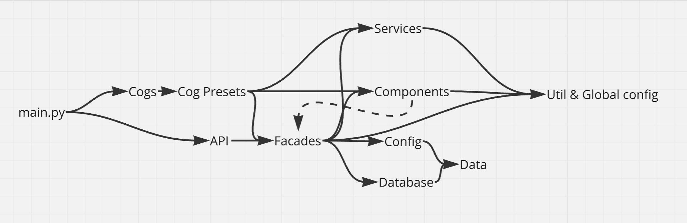

The dashed dependency is unadvised, but sometimes used via local imports (cases when one function of a facade displays a component, interacting with which should trigger another function of the same facade).

### Deployment

The bot can be run simply by executing the `python main.py` command (or `python main.py --debug` to launch it on a testing stage). However, the version of Python should be at least 3.12 and the requirements specified in the `requirements.txt` file should be met. Moreover, the environment variables should be set: `BOT_TOKEN` for Discord bot token and `API_TOKEN` that the API for integration with the Request Bot Control Panel will use.

The intended way of deploying the bot is via Docker. The `Dockerfile` for building the image is available in the root of the repository.

Because of that, the simplest option for hosting the bot seems to be finding the hosting / cloud platform provider that supports creating virtual machines from Docker images. For instance, the original version of this bot is hosted on **Yandex.Cloud Container Solution**.

There is one downside to that, though. Since this bot uses SQLite as its DBMS, to update the bot, one will have to upload the image **containing** the database file (located at `data/database.db`) created by invoking the `/backup save` command right before the upgrade.