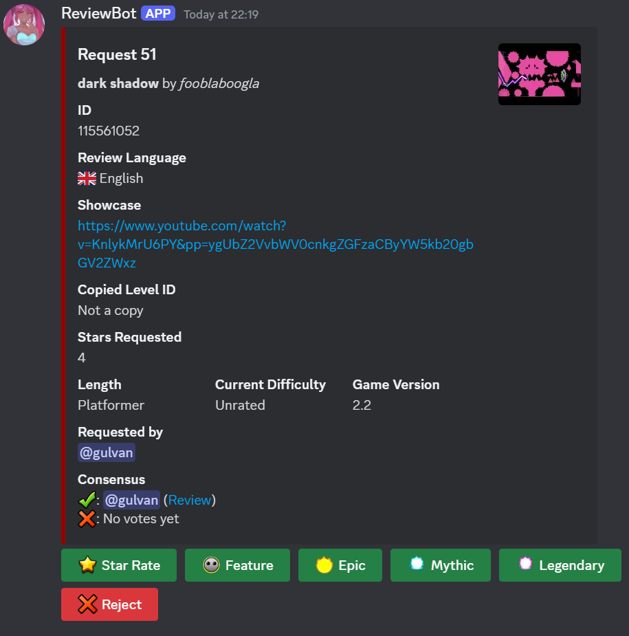

# GD Level Request Bot

This feature-rich bot is designed to simplify and automate the process of requesting and reviewing Geometry Dash levels.

**Features**:

- Simple and intuitive level request creation
- Two-step reviewing system with a friendly UX
- Trainee system
- Effortless management
- Flexible and easy-to-setup permissions
- Adjustable cooldowns and bans both for users AND levels
- Automatic and manual request queue opening and closing
- Detailed logs and a built-in log browser with rich filtering
- Thorough integration with the [Request Bot Control Panel](https://github.com/Gulvan0/RequestBotControlPanel)
- BI analytical report system providing insights about reviewer and regular member involvement
- 100% localized, supporting both English and Russian and automatically adapting to the interacting user
- Fully customizable: everything from texts and channels to behaviour parameters can be changed just by typing a command
- Regular database backups and a command for rolling back to the saved snapshot
- Instant and descriptive PM error notification
- Lots of QoL commands and stuff

## User Guide

### Requests

#### Standard Request Flow

To request a level, a server member must use the `/request create <level_id>` command and then fill and submit the pop-up modal.

This will trigger a sequence of checks:

1. Is the request queue open? 
    
    _Users with the `request_while_queue_closed` permission bypass this check._

2. Is the user currently on cooldown?

    _Users with the `no_request_cooldown` permission bypass this check._

    _Staff members with the `ban_users` permission can lift the cooldown (see the **Cooldowns and Bans** section)._

3. Has the requested level already been approved by one of the mods?

4. Is this level currently being reviewed?

5. Does a level with the provided ID exist?

6. Is the requested level currently on cooldown?

    _Staff members with the `ban_levels` permission can lift the cooldown (see the **Cooldowns and Bans** section)._

7. Is the requested level already rated?

8. Is the provided showcase link a valid YouTube video link?

All enlisted checks except the last one are evaluated **before** a modal appears, saving time and effort in case of an occasional mistake.

If any of the checks is failed, a bot will respond with a clear explanation of what went wrong.

The language of the request is detected automatically. For more details, refer to the **Language** section.

If the checks mentioned above are passed, a bot stores a level request to a database and sends the _Reviewer's Widget_ to a specific channel.

Here, any reviewer (i.e. a user with the `reviewer` permission) can leave the opinion regarding the level and, optionally, a review. 

If additional details can or should be provided (a review if a reviewer chose to leave one and/or a rejection reason if a reviewer rejected the level), pressing the respective button will cause a modal to appear. It is mandatory to specify the reason for rejecting the level if a review is not provided, but otherwise it's not required.

If a reviewer chooses to leave a level review, the request author gets immediately notified. This, however, does not apply to the opinions left without a review.

If a `request.append_conclusion_to_review` parameter is set to `true`, a conclusion exposing the reviewer's opinion is appended to the review text. By default, this feature is not enabled so as not to provoke questions in case of a discrepancy between regular reviewers' opinions and the final decision made by a GD moderator.

Reviewers can only leave their opinion (and, possibly, a review) once per each request. It's not possible to change the opinion or change the review's text after they were submitted.

Once the first opinion is received, a _Resolution Widget_ gets posted in the channel for GD moderators.

It has all the info from the Reviewer's Widget and also a _Consensus_ section outlining the opinions left by reviewers. Once a new opinion is received, this section gets updated accordingly.

If a reviewer left an opinion with a level review, a link leading to the message with the review text will be provided. Otherwise, if a rejection reason is specified, it's text will be provided instead.

Only GD moderators (users with a `gd_mod` permission) are allowed to interact with the Resolution Widget.

Like with Reviewer's Widget, one GD moderator can resolve each request only once. And, likewise, it's neither possible to change the resolution, nor update the text of the review that came with it.

Pressing any button will cause the modal to appear. In this modal, a review text (and, when rejecting a level, a rejection reason) may be provided. Both those fields are, however, optional.

After the modal is submitted, the request will get resolved, which implies the following sequence of events:

1. If a review is provided, its text will be sent to the reviews channel and the request author will get pinged. This is completely identical to how it happens after a regular reviewer leaves a review. The reviews left via the Resolution Widget will always have a conclusion outlining the final decision (unlike regular reviewers' reviews, appending the conclusion under which can always be turned on and off by changing the `request.append_conclusion_to_review` parameter).

2. In the same manner as with regular reviewers' opinions, the resolution gets appended to the Resolution Widget. While reviewers' opinions are listed in the _Consensus_ section of the embed, the resolutions fall into the separate _Resolutions_ section.

3. The Reviewer's Widget gets moved from the channel for reviewers to the archive channel. The embed changes the color from yellow to gray and the interaction buttons get removed. Moreover, a link leading to the Resolution Widget is appended to the embed, making it easy to check the resolutions for an archived level, if an interested user has access to the GD moderator channel.

    

4. The Resolution Widget does **not** get removed and its buttons stay intact so that other GD moderators are able to leave their own independent decisions regarding the level. The color of the embed, however, changes from red to green to indicate that the corresponding request has already been resolved.

5. The request author gets notified about the final decision. The approval and rejection notifications go to the two different channels, but they can be configured to point to the same one (see the **Updating the message's destination channel** section).

    

It is important to point out that GD moderators with the `reviewer` permission can leave opinions via the Reviewer's Widget like regular reviewers. It may be useful when all the requests awaiting final resolution were resolved, but the regular reviewers still haven't left their opinions on all the requested levels.

In this situation, a GD moderator should leave the review **only once** (either via the Reviewer's Widget or via the Resolution Widget, but not both!). Otherwise, the ping in the reviews channel will get duplicated.

#### Picking the right request

It is advised that the moderators looking for the requests to review prioritize ones with the red Resolution Widgets. This way, more level requests get resolved.

To pick an unresolved request without having scroll through the Resolution Widgets, a GD moderator may use the command `/request unresolved`.

Similarly, a regular reviewer may use the command `/request ignored` to pick a request without opinions. It is better to leave an opinion on such requests first.

#### Finding a request for a certain level

To find the latest request by a requested level's ID, use command `/request widgets <level_id>`. It will print the links leading to all the available widgets corresponding to the most recent request of the given level.

The link to Resolution Widget is only provided if a level has more than one opinion.

If the request is resolved, the first link will lead to the archive entry rather than to the Reviewer's Widget (which has already been deleted in that case).

#### Inserting a request on behalf of another person

To swiftly request a level bypassing all the checks (where possible), any user with the `insert_requests` permission can use the command `/request insert`. This also allows to create requests on behalf of another creator.

The `/request insert` command takes the following parameters:

1. `level_id`

    ID of a requested level, just like with the normal `/request create` command.

2. `language`

    Language of the request. The reviews will be asked to be written in this language. Moreover, this language will be used for communication with the request author in all of the notifications.

    Set this to the language spoken by the creator on behalf of whom you're requesting a level. If not sure, pick English.

3. `yt_link`

    A link to the YouTube video showcasing the level. Just like in the request creation modal.

4. `creator_mention`

    A tag of the creator of the level. This member will be pinged in every notification.

    If it's impossible to find a level creator on a current Discord server, omit this option and pass `creator_name` instead.

5. `creator_name`

    A name of the creator of the level. The notifications will address the author by this name, however, they won't ping anyone.

    If you're able to find a level creator on the server, it's better to pass their tag to the `creator_mention` argument instead.

    At least one of the options `creator_mention` and `creator_name` must be provided. It is assumed only one of them is actually passed. Conversely, if both are provided, `creator_mention` takes precedence and `creator_name` gets ignored completely.

6. `additional_comment`

    Any additional info that will appear in the request's widgets. Just like in the request creation modal.

    This argument may be omitted if there's nothing special to say about this request.

### Queue

### Cooldowns and Bans

### Trainees

### Reports

### Language

### Permissions

### Parameters

### Message Routes

### Message Templates

### Logs

### Backup

### Error Handling

## Command Reference

## Contributing

### Minimal Prerequisites

### Code structure

### Deployment